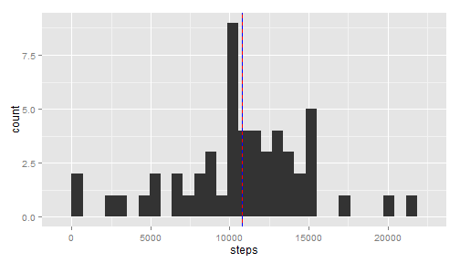
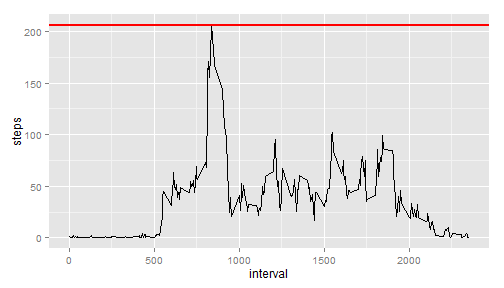
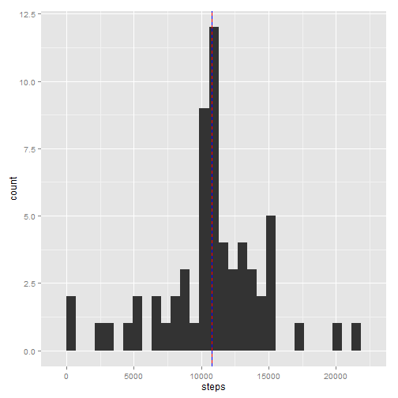

## Loading and preprocessing the data

```r
library(plyr)
library(dplyr)
library(ggplot2) # invoke libraries
data<-read.csv(file = "repdata_data_activity/activity.csv",header = TRUE) # read data from directory
data_df<-tbl_df(data) # convert to table-data-frame for using 'dplyr'
```


## What is mean total number of steps taken per day?

```r
z<-aggregate(steps ~ date, data_df, sum)
mean_val<-mean(z[,2],na.rm = TRUE)
median_val<-median(z[,2],na.rm = TRUE)
```

The value of the mean number of steps per day are:1.0766189 &times; 10<sup>4</sup> and median is : 10765


```r
qplot(x = steps, data = z)+
     geom_vline(aes(xintercept=mean_val),color="red", linetype="solid", size=.5)+
     geom_vline(aes(xintercept=median_val),color="blue", linetype="dashed", size=.5)
```

```
## stat_bin: binwidth defaulted to range/30. Use 'binwidth = x' to adjust this.
```

 

## What is the average daily activity pattern?


```r
z<-aggregate(steps ~ interval, data_df, mean)
qplot(x = interval,y=steps, data = z,geom="line")+
     geom_hline(aes(yintercept=max(steps, na.rm=T)),color="red",linetype="solid", size=1)
```

 


## Imputing missing values

The total number of NA valued fields is: 2304


```r
dates<-data_df[,2]                #|
dates<-as.factor(unlist(dates))   #|  takes out the date field, 
dates<-as.Date(dates)             #|  converts it to a table of dates  
data_df[,2]<-dates                #|  and is re-placed in the data-frame
mean_val_by_interval<-summarise(group_by(data_df,interval),mean(steps,na.rm=T))
# our reference chart for values of avg. steps by time interval

# replaces all NAs with avg. value in that interval from "mean_val_by_interval" chart. 
for( i in seq(nrow(data_df[,2])))
     {
     if (is.na(data_df[i,1])) # serach
          {
          for (j in seq(seq(0,2355,by=5))) # find
               {   
               if (data_df[i,3]==mean_val_by_interval[j,1])
                    {
                    data_df[i,1]<-mean_val_by_interval[j,2]  # replace
                    break # repeat
                    }
               }
          }
     
     }     


z<-aggregate(steps ~ date, data_df, sum) #the function that saved me from failing the assignment!!!


qplot(x = steps, data = z)+  
     #| plot the basic histogram
     geom_vline(aes(xintercept=mean(steps, na.rm=T)),color="red", linetype="solid", size=.5)+ 
     #| a nice red solid line to show mean
     geom_vline(aes(xintercept=median(steps, na.rm=T)),color="blue", linetype="dashed", size=.5)
```

```
## stat_bin: binwidth defaulted to range/30. Use 'binwidth = x' to adjust this.
```

 

```r
#| a blue dotted one that almost sits on the red line to show median
```
## Are there differences in activity patterns between weekdays and weekends?


```r
day<-weekdays(dates) # looks for days of the week 
day<-as.factor(day)
day<-revalue(day, c("Monday"="weekday", "Tuesday"="weekday","Wednesday"="weekday","Thursday"="weekday","Friday"="weekday","Saturday"="weekend","Sunday"="weekend")) # replacement of days to either weekdays or weekends
data_df<-cbind(data_df,day)
z<-aggregate(steps ~ interval+day, data_df, mean) #the function that saved me from failing the assignment!!!
```

The varied behaviour of steps taken on weekdays vs weekends is shown below:


```r
qplot(x = interval,y=steps, data = z,facets = .~ day,geom="line") 
```

 

```r
# couldn't get facet_wrap to work  
```
